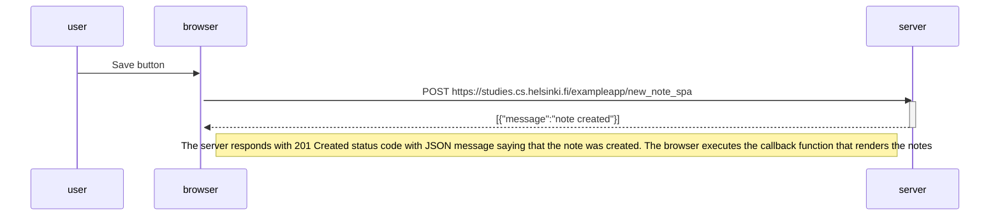

```mermaid
sequenceDiagram
    participant user
    participant browser
    participant server

    user->>browser: Save button
    activate browser

    browser->>server: POST https://studies.cs.helsinki.fi/exampleapp/new_note_spa
    activate server
    server-->>browser: [{"message":"note created"}]
    deactivate server

    Note right of browser: The server responds with 201 Created status code with JSON message saying that the note was created. The browser executes the callback function that renders the notes
```